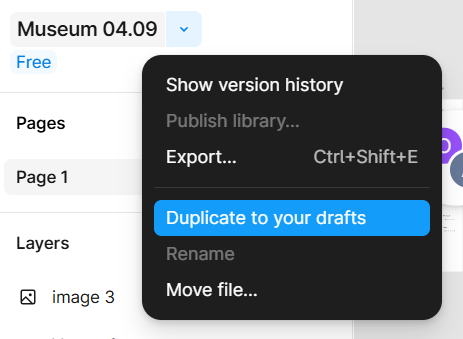

## Figma  
Последнее обновление текста 2025.06.13  

Figma - онлайн-сервис для разработки интерфейсов и прототипирования с возможностью организации совместной работы. Есть бесплатный тарифный план для одного пользователя. Работать удобнее с десктопным приложением [Figma](https://www.figma.com/downloads/).  

Для загрузки готового макета (xxx.fig) в Figma, перейти слева в пункт меню `Recent` и выбрать в полосе кнопок Recent первую кнопку справа `Import`.  
  

Если макетом поделились и его нужно для работы дублировать в папку Drafts, нужно в меню слева нажать на имя макета, открыть выпадающее меню и в нем выбрать `Duplicate..`.  
  

Режим для вёрстки Dev Mode теперь платный, в виде замены можно пользоваться бесплатными плагинами `Inspect Styles` и `Figma to Code`. Для установки плагинов нужно вызвать меню на экране с загруженным макетом правой кнопкой мыши и выбрать Plugins → Manage plugins, в открывшемся окне найти нужный плагин и нажать на кнопку `Save`, что сохранит плагин для быстрого запуска. Так же меню плагинов можно открыть по нажатию на значок Фигмы в левом верхнем углу.  
  

